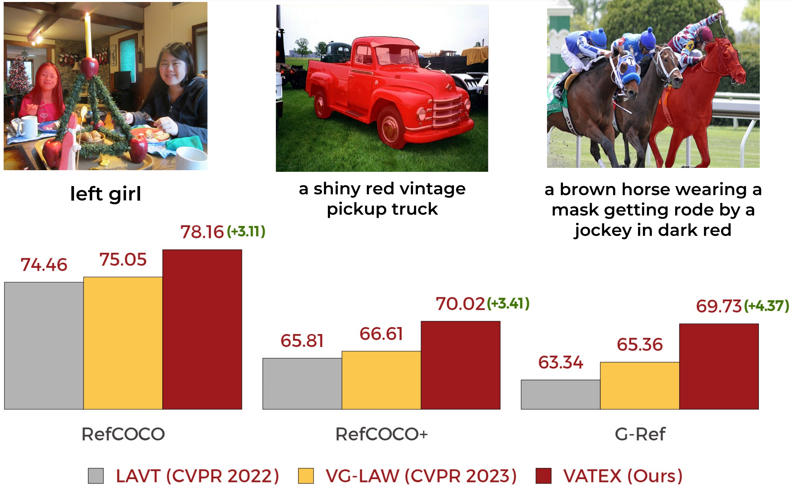
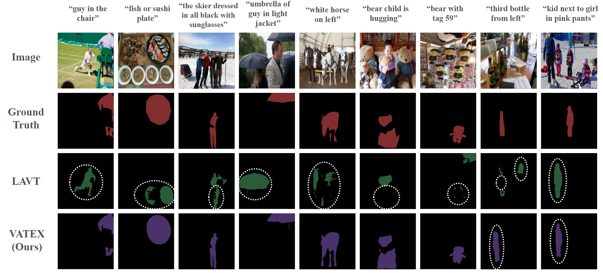

The official implementation of the paper:

<div align="center">
<h1>
<b>
VATEX: Improving Referring Image Segmentation <br> using Vision-Aware Text Features
</b>
</h1>
</div>
<p align="center">
  
</p>

## Abstract
Referring image segmentation is a challenging task that involves generating pixel-wise segmentation masks based on natural language descriptions. Existing methods have relied mostly on visual features to generate the segmentation masks while treating text features as supporting components. This over-reliance on visual features can lead to suboptimal results, especially in complex scenarios where text prompts are ambiguous or context-dependent. To overcome these challenges, we present a novel framework VATEX to improve referring image segmentation by enhancing object and context understanding with Vision-Aware Text Feature. Our method involves using CLIP to derive a CLIP Prior that integrates an object-centric visual heatmap with text description, which can be used as the initial query in DETR-based architecture for the segmentation task. Furthermore, by observing that there are multiple ways to describe an instance in an image, we enforce feature similarity between text variations referring to the same visual input by two components: a novel Contextual Multimodal Decoder that turns text embeddings into vision-aware text features, and a Meaning Consistency Constraint to ensure further the coherent and consistent interpretation of language expressions with the context understanding obtained from the image. Our method achieves a significant performance improvement on three benchmark datasets RefCOCO, RefCOCO+ and G-Ref. 

<!-- ## Update
``` update here ``` -->
## Requirements
We test our work in the following environments, other versions may also be compatible:
- CUDA 11.1
- Python 3.8
- Pytorch 1.9.0

## Installation
Please refer to [installation.md](docs/installation.md) for installation

## Data preparation
Please refer to [data.md](docs/data.md) for data preparation.

## Getting Started with VATEX 
Download the pretrained model from ImageNet of Swin-B, Swin-L and Video-Swin-B and put in weights folder 

## Training 
To train VATEX with "train_net_video.py", first setup the corresponding datasets following [data.md](docs/data.md), then run:
```
python train_net_video.py --config configs/refcoco/swin/swin_base.yaml --num-gpus 2 OUTPUT_DIR ${OUTPUT_DIR} $
```
where OUTPUT_DIR is the output direction to save weight and log.

To resume the training process 
```
python train_net_video.py --config configs/refcoco/swin/swin_base.yaml --num-gpus 2 --resume OUTPUT_DIR ${OUTPUT_DIR} $
```
## Evaluation
```
python train_net_video.py --config configs/refcoco/swin/swin_base.yaml --num-gpus 2 --eval-only OUTPUT_DIR ${OUTPUT_DIR} $ MODEL.WEIGHTS link_to_weights
```
## Main Results

Main results on RefCOCO

| Backbone | val | test A | test B |
| ---- |:-------------:| :-----:|:-----:|
| ResNet101 | 75.66 | 77.88 | 72.36 |
| Swin-B | 78.16  |   79.64  | 75.64 |

Main results on RefCOCO+

| Backbone | val | test A | test B |
| ---- |:-------------:| :-----:|:-----:|
| Swin-B | 70.02 | 74.41 | 62.52 |

Main results on G-Ref

| Backbone | val | test |
| ---- |:-------------:| :-----:|
| Swin-B | 69.73 | 70.58|


## Demo
<p align="center">
  
</p>
